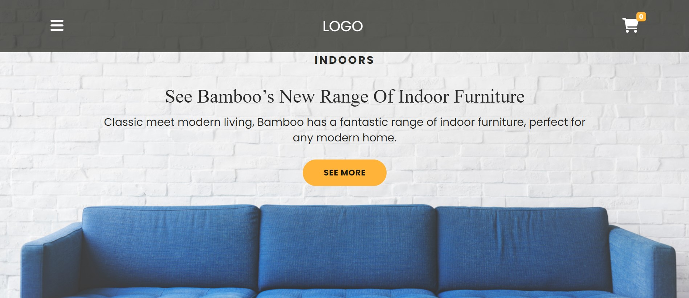
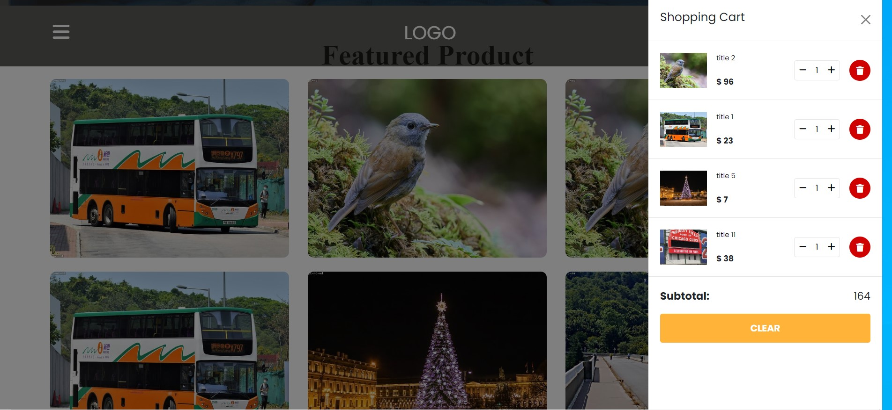
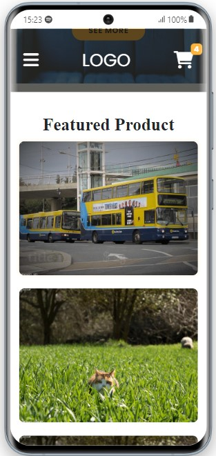
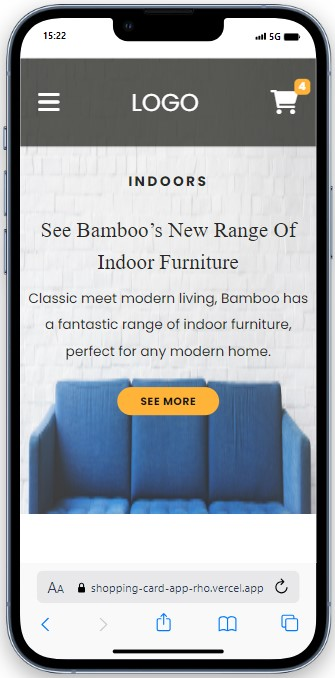

 

  

  <h3 align="center">My Shopping Cart</h3>

  

   Bu proje, alışveriş sepeti özelliğine sahip basit bir web uygulamasını içermektedir.
     
    <a href="https://shopping-card-app-rho.vercel.app/"><strong>LIVE »</strong></a>
     
  

## İçindekiler

- [Genel Bakış](#genel-bakış)
- [Kullanılan Teknolojiler](#kullanılan-teknolojiler)
- [Kurulum](#kurulum)
- [Kullanım](#kullanım)
- [Ekran Görüntüleri](#ekran-görüntüleri)
- [Responsive Tasarım](#responsive-tasarım)
- [Rastgele Veriler](#rastgele-veriler)
- [Lisans](#lisans)

## Genel Bakış

Uygulama, kullanıcıların ürünleri listeleyebileceği, sepete ekleyebileceği ve sepetin içeriğini görüntüleyebileceği bir alışveriş sepeti simülasyonunu içerir. Kullanıcılar aynı zamanda sepet içindeki ürünleri silebilir ve miktarlarını güncelleyebilir.

## Kullanılan Teknolojiler

- HTML
- CSS
- JavaScript
- Bootstrap 5

## Kurulum

1. Bu depoyu bilgisayarınıza klonlayın veya ZIP olarak indirin.
2. İndirdiğiniz dizine gidin ve `index.html` dosyasını bir tarayıcıda açın.

## Kullanım

1. Ana sayfa üzerindeki ürünleri görüntüleyin.
2. Beğendiğiniz ürünleri sepete eklemek için "Add to Cart" butonunu kullanın.
3. Sepetin içeriğini görmek için sağ üst köşedeki sepet simgesine tıklayın.
4. Sepet içindeki ürünleri silebilir veya miktarlarını güncelleyebilirsiniz.

## Ekran Görüntüleri

 

## Rastgele Veriler

API'den gelen veriler rastgele oluşturulmuş örnek verileri içerir ve her seferinde 20 farklı fotağrafla sepet simüle edilir.

## Responsive Tasarım
Bu uygulama responsive tasarıma sahiptir ve farklı ekran boyutlarına uyum sağlar.

### On Mobile 📲

     
     

